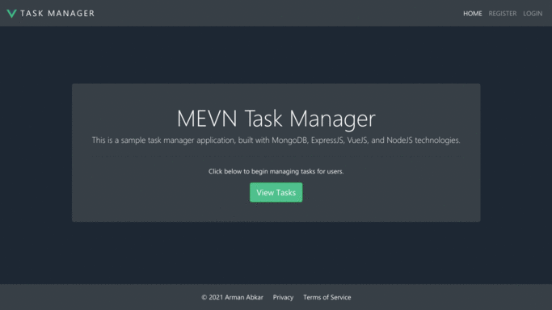

# MEVN Stack Task Manager

Simple app for managing tasks and users built with MEVN stack (MongoDB, Express, Vue & Node).

<h2 align="center">
  
  <br>
</h2>

### Prerequisites

[NodeJS](https://nodejs.org) -
[MongoDB](https://www.mongodb.com/) -
[VueJS](https://vuejs.org/) -
[VueJS CLI](https://cli.vuejs.org/) 

## Installation & Usage

First, install all of the NodeJS dependencies (located in **package.json** file)
```
$ npm install
```

## Development

To begin development, you must start the NodeJS Server and VueJS Server. In addition, you need to compile the server files with the Babel Compiler.

### Run all development scripts in one


```
$ npm run dev
```

Alternatively, you can run each of the three scripts individually:

### Compile NodeJS Server files

```
$ babel server --out-dir prod-server --watch
```
### Start NodeJS Server
```
$ node prod-server/index.js
```
### Start VueJS Development Server
```
$ vue-cli-service serve
```
## Common Issues

 - Unable to refresh in production
	 - If you are unable to refresh in production mode, ensure your index.js server file has:

```
app.get('*', (req, res)...
```
instead of:
```
app.get('/')
```

 - Cannot Set Environment
	 - Windows users will need to adjust the application scripts in **package.json** from:
```
export NODE_ENV=production
```
to
```
set NODE_ENV=production
```

## Built With

* [MongoDB](https://www.mongodb.com/) - Open Source NoSQL Database
* [ExpressJS](https://expressjs.com/) - NodeJS Web Framework
* [VueJS](https://vuejs.org/) - JavaScript UI Framework
* [NodeJS](https://nodejs.org/en/) - JavaScript runtime built on Google Chrome's V8 JavaScript engine


## Author

* **David Acosta** - [Portfolio](http://www.acostadavid.com/),  [YouTube](https://www.youtube.com/channel/UCKrHQelsiwrVUZ7v9nLCwgA)
* modified by **Arman** 
## License

This project is licensed under the MIT License - see the [LICENSE.md](LICENSE.md) file for details
